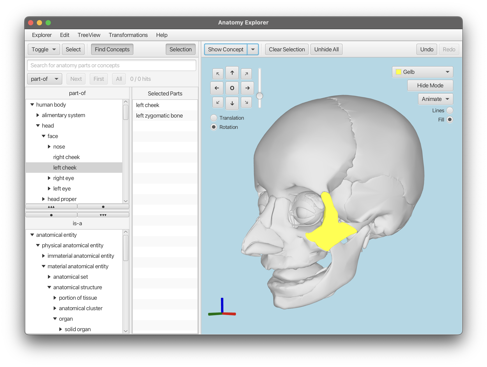

# Advanced Java Repository of Niklas M. Gerbes

# Closing Project: Anatomy Explorer

## Behind the project: BodyParts3D Database
The Project is based on a Database for 3D anatomy visualizations by Fujieda et al.

>Mitsuhashi N, Fujieda K, Tamura T, Kawamoto S, Takagi T, Okubo K.
BodyParts3D: 3D structure database for anatomical concepts.
Nucleic Acids Res. 2008 Oct 3.
PMID: 18835852

## problems I encountered:
There is one big Problem overall: Connect both Trees (isA and partOf relations) that use fundamental different
concepts. The following properties made it hard to synchronize the selection over all three: both TreeViews and the visualization Pane:
- One FileID can be associated with multiple concepts WITHIN one tree 
  - A selection in the 3D pane can lead to multiple selection in either TreeView.
  - The most prominent example is "skin" and "integumentary system" from the partOf tree. Both concepts share the fileID FJ2810.
  If we interpret the fileIDs as SourceOfTruth for Our selection. Then selecting "skin" has to lead to a selection of "integumentary system".
  Or the other way around: selecting the mesh FJ2810 has to lead to the selection of "skin" and "integumentary system" in partOf and the associated Nodes in the isA tree.
- One Concept can have multiple FileIDs associated with it (Selecting a node in a TreeView can lead to a selection of multiple MeshView in the 3D pane).
- Concepts that have the same conceptID usually do not share the same Meshes (or fileIDs).
- Leaves of partOf and isA are not fully contained within each other (partOf has 869 leafes, isA has 1651 leafes and 770 leafes in total are common).

So it was quite some work to figure out how exactly to parse selections between the trees and visPane.

This deep dive into the connections between FileIDs and ConceptIDs revealed
that selecting one Node in a tree view should induce the selection of other nodes if they share the associated FileIDs.
Originally, it was implemented like that and node selection would cascade to every concept (TreeItem) that shared its FileID.

**But I decided on an asymmetric synchronization. Meaning selecting a TreeView leaf marks only its corresponding mesh as 
selected (one-to-one), whereas clicking a mesh selects all TreeItems sharing that mesh’s FileID (one-to-many).**

By restricting tree-to-mesh to a single mesh per node, we avoid unwanted selections in the concept hierarchy. 
Mesh-driven selection therefore shows every related TreeItem so that all associated concepts remain visible.
The trade-off is simpler tree navigation at the cost of non-uniform selection behavior depending on whether one click 
in the tree or on a mesh directly.

## Dev-Notes

### The idea of Commands - Undo / Redo

#### "Capture"-Commands
"Capture" commands are designed to record the start and end states of a continuous user interaction,
such as drag-based rotations or translations. Instead of creating a new command for every small
movement during the interaction, a single "Capture" command is created once, when the user releases
the mouse. This approach prevents the undo stack from being flooded with micro-commands and ensures
that the entire interaction is treated as a single, atomic undoable action.

## Declaration of AI generated content in this project
- The whole program design is fully planned and implemented by myself.
- Parts of the .start() methods in `ContRotationAnimation.java`, `ExplosionAnimation.java` and `PulseAnimation.java` are implemented by a 
LLM but are modified by me.
- Most of the Documentation-Strings are generated by an LLM and rephrased or changed individually by me.
