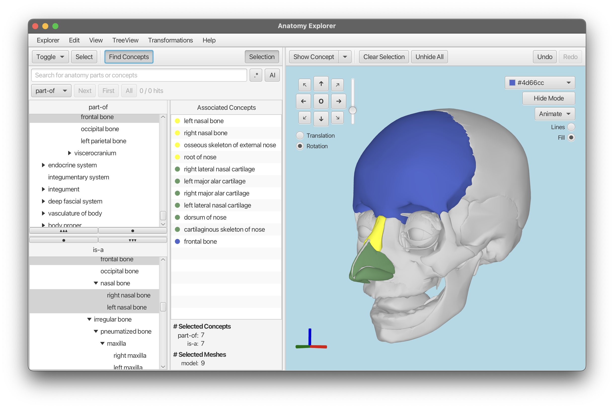
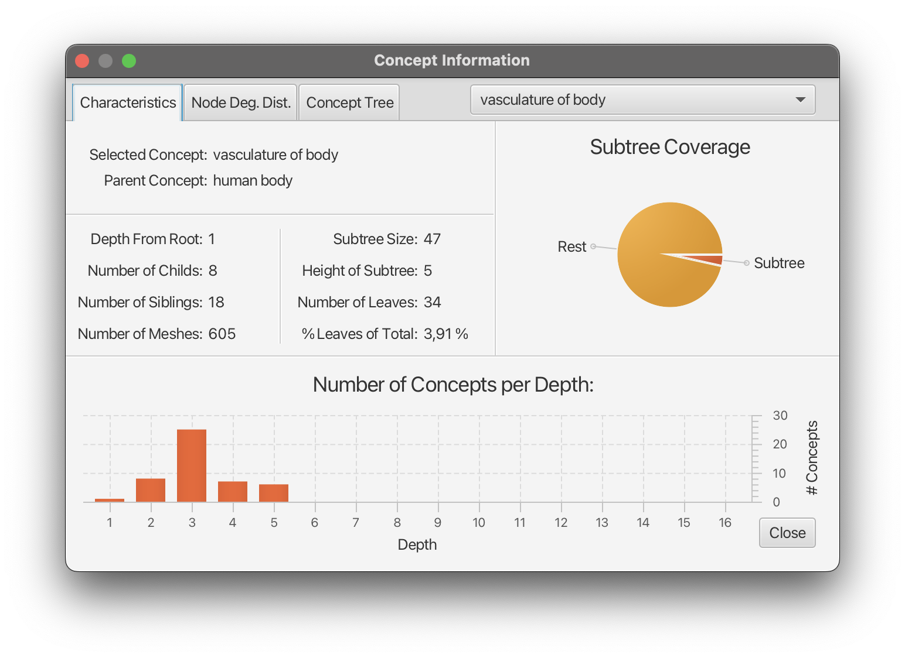
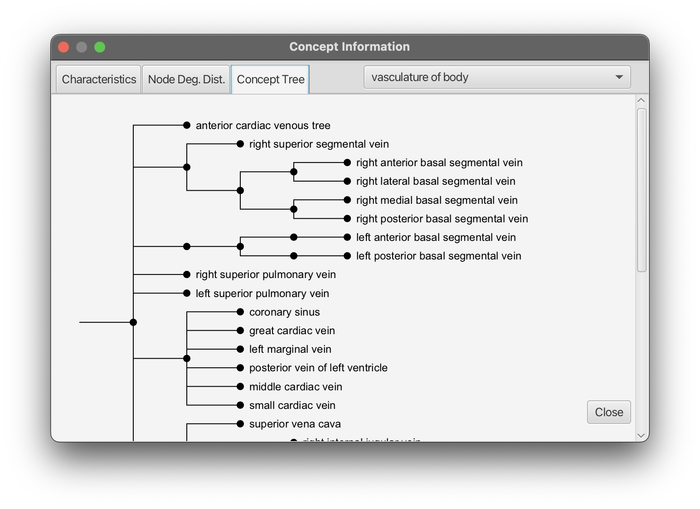
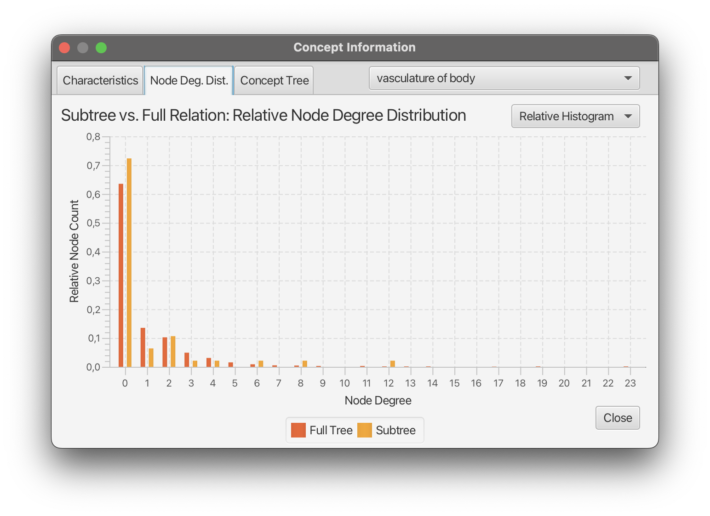
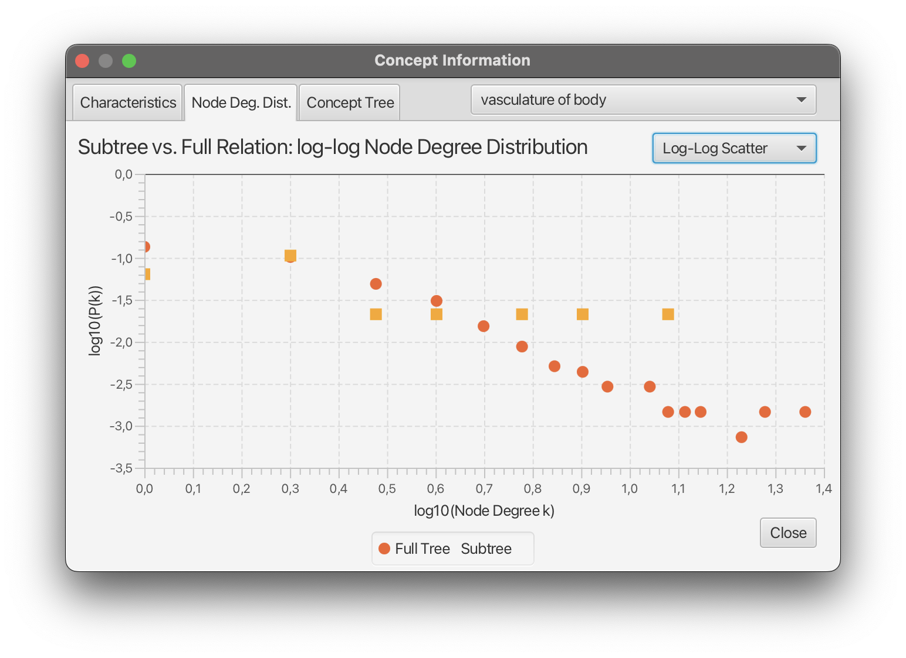

# Advanced Java for Bioinformatics: Closing Project - Anatomy Explorer
> Repository of Niklas M. Gerbes

|  |  |
|-------------------------------------------------------------------|--------------------------------------------------------|
|  | |

## Behind the project: BodyParts3D Database
The Project is based on a Database for 3D anatomy visualizations by Fujieda et al.

>Mitsuhashi N, Fujieda K, Tamura T, Kawamoto S, Takagi T, Okubo K.
BodyParts3D: 3D structure database for anatomical concepts.
Nucleic Acids Res. 2008 Oct 3.
PMID: 18835852, DOI: [10.1093/nar/gkn613](https://doi.org/10.1093/nar/gkn613)

---

## Functionalities

- Exploring a fully modeled Human Body.
- Show only specific Concepts (i.e. Subtrees of the full relation Tree) in the 3D model.
- Select "Lines" to render meshes in wireframe mode, showing only edges for a see-through effect.
- Hide specific meshes by activating the "Hide Mode" and selecting the Meshes to disappear.
- Selecting & coloring Meshes or Concepts.
- See all selected parts in the "Selected Parts" list colored in their respective color.
- Rotate, Explode or Pulse the currently shown Model.
- Searching specific concepts (case insensitive)
- Use Regex to search for patterns
- Use AI queries directly inside the search field to let chatGPT return a Regex that matches your query.
- Un- or Redo every action performed (Zoom, Pan, Rotate, Select, Animate, Hide)
- Choose between Dark mode and Light mode
- Get specific knowledge of selected Concepts by openening the "Concept Information" window
  - Get characteristics / statistics about the Concept and its subtree
  - Get Informations about the Number of Nodes per Depth
  - Compare the Node Degree Distribution between Subtree vs. Full Relation tree
  - Explore the Tree rooted at the selected Concept

---

## Dev-Notes

### Problem 1: partOf & isA trees and their selection synchronization to the 3D model
There is one big Problem overall: Connect both Trees (isA and partOf relations) that use fundamental different
concepts. The following properties made it hard to synchronize the selection over all three: both TreeViews and the visualization Pane:
- One FileID can be associated with multiple concepts WITHIN one tree
  - A selection in the 3D pane can lead to multiple selection in either TreeView.
  - The most prominent example is "skin" and "integumentary system" from the partOf tree. Both concepts share the fileID FJ2810.
    If we interpret the fileIDs as SourceOfTruth for Our selection. Then selecting "skin" has to lead to a selection of "integumentary system".
    Or the other way around: selecting the mesh FJ2810 has to lead to the selection of "skin" and "integumentary system" in partOf and the associated Nodes in the isA tree.
- One Concept can have multiple FileIDs associated with it (Selecting a node in a TreeView can lead to a selection of multiple MeshView in the 3D pane).
- Concepts that have the same conceptID usually do not share the same Meshes (or fileIDs).
- Leaves of partOf and isA are not fully contained within each other (partOf has 869 leafes, isA has 1651 leafes and 770 leafes in total are common).
- Internal Nodes can be annotated with FileIDs that are not part of ANY leaf below that internal node.

So it was quite some work to figure out how exactly to parse selections between the trees and visPane.

This deep dive into the connections between FileIDs and ConceptIDs revealed
that selecting one Node in a tree view should induce the selection of other nodes if they share the associated FileIDs.
Originally, it was implemented like that and TreeItem selection would cascade to every concept (TreeItem) that shared its FileID.

**But I decided on an asymmetric synchronization. Meaning selecting a TreeView leaf marks only its corresponding mesh as
selected (one-to-one), whereas clicking a mesh selects all TreeItems sharing that mesh’s FileID (one-to-many).**

By restricting tree-to-mesh to a single mesh per node, I avoid unwanted selections in the concept hierarchy.
Mesh-driven selection therefore shows every related TreeItem so that all associated concepts remain visible.
The trade-off is simpler tree navigation at the cost of non-uniform selection behavior depending on whether one click
in the tree or on a mesh directly.

### Problem 2: Adding the meshes to the scene
The actual parsing of the .obj files into the system (HumanBodyMeshes.loadMeshes()) is quite performant. 
This is because I use a combination of multiThreadding for parallel reading of the .obj files and a Task<T> 
that decouples that call from the FX thread to keep the GUI responsive and even display a progressBar.
The problem is not within the parsing but within the adding of each mesh to the Scene 
(anatomyGroup.addAll(humanBodyMeshes.getMeshes())). Since we have over 2000 individual Meshes, this call is super expensive
and freezes the GUI for 2 up to 4 seconds. This is NOT ideal! but several points make it a necessity:
1. The full Body view is the "initial" state since it basically shows ALL meshes there are.
    For me as a user, that is what I would expect to see when loading the program.
2. Loading the full HumanBody initially takes some time but after that, switching to ANY Concept (subSet of all Meshes) and back
    to the full humanBody is super fast and takes no time. This is because of the internal caching and GPU-upload.
    Thus with one initial slightly longer freeze I can guarantee that switching to any other Concept will happen instantly.
3. .addAll on a JavaFX Group must happen within a JavaFX task. So there is no possibility to render the Meshes in a seperate
    Thread
4. Packing all meshViews into one large TriangleMesh would speed up the whole process and might not lead to a GUI freeze
    but then I will loose the possibility to handle each mesh separately (e.g. make a single mesh clickable in the Scene,
    color seperate meshes differently or dynamically show different Concepts).

The last option would have been to implement something like "Lazy attach" that would add 100 meshes say, to the scene
per KeyFrame. 
I tried this option and while it showed the progress on how the meshes are added, the GUI stayed unresponsive.

### Problem 3: TreeView selections not working reliable
Selecting additional TreeItems (for example, via `binding.selectInBoundTree(item)` in response to mesh selections)
sometimes caused previously selected items to be lost, especially when the tree was initially collapsed.
Under certain conditions, JavaFX’s `TreeView` model mishandles updates and drops valid selections.

Calling `selectionModel.select(item)` on a node that is not currently visible
(i.e. not expanded, yielding no valid row index) could also introduce unrelated “ghost”
selections (e.g. `"abdomen"` or `"thoracic segment"`), even though those were never requested.

To address both issues, I implemented a strategy that required an additional treeView specific Set that kept track on which
TreeItems are actually selected.:
- Keep the tree internal tracker synchronized:
  - Preserve existing selections before selecting any new items by storing the current selection in `binding.selectionTracker`.
  - Perform targeted selection by calling `binding.selectInBoundTree(item)` for each selected node.
- Cleanup pass (`cleanupTreeView`):
    - Clear ghost selections: Remove any UI‑selected items that are not in the tracker using `clearInBoundTree(item)`.
    - Restore missing selections: Re‑select any items in the tracker that are absent from the current UI selection.

This guarantees that:
1. All previously selected items remain intact.
2. Only the intended TreeItems are ever selected.
3. Any erroneous or phantom selections are reliably removed.

### Invalidate Configs instead of "File" -> "Open"

Instead of letting the user manually load different 3D models through a classic “Open…” dialog, 
I designed the application to always work with one the initially loaded HumanBody instance. T
hat decision was made for three main reasons:
1.	Single-model architecture: 
        The program is built around a single, consistent anatomical dataset. 
        Loading another would break this assumption.
2.	Consistency with the UI:
        The tree views (like the “is-a” or “part-of” hierarchy) are directly linked to this one model.
        Switching to a different model would require real-time rebinding and remapping,
        which would add complexity and introduce error potential.
3.	Simplified event binding:
        Listeners and references are tightly connected to the first loaded HumanBody.
        Replacing it would mean carefully unhooking and rehooking many components every time.

Instead of dynamically switching models at runtime, I added a configuration mechanism: 
when the saved path to the 3D model (the isa_BP3D_4.0_obj_99 folder) 
becomes invalid the app doesn’t just break silently. 
On startup the user is then prompted to re-select the correct folder.
This happens via an overlay UI that disables further interaction until a valid path is chosen. 
Once the new folder is selected, the app saves the new path and continues to load the anatomical model.
This keeps everything simple, stable, and predictable, while still offering a fallback for broken config paths.

### Structuring the GUI in three main Components: 'MainView', 'SelectionView' and 'VisualizationView'

### The GuiRegistry

### Organizing the "HumanBodyMeshes"

### SelectionBinder & How Selections work

### The idea of Commands - Undo / Redo

#### "Capture"-Commands
"Capture" commands are designed to record the start and end states of a continuous user interaction,
such as drag-based rotations or translations. Instead of creating a new command for every small
movement during the interaction, a single "Capture" command is created once, when the user releases
the mouse. This approach prevents the undo stack from being flooded with micro-commands and ensures
that the entire interaction is treated as a single undoable action.

---

## Declaration of AI generated content in this project
- The whole program design is fully planned and implemented by myself without any help of AI.
- Parts of the .start() methods in `ContRotationAnimation.java`, `ExplosionAnimation.java` and `PulseAnimation.java` are implemented by a 
LLM but are modified by me.
- Smaller code fragments may be inspired by AI but are not copy-pasted.
- Most of the Documentation-Strings are generated by an LLM and rephrased or changed individually by me.
