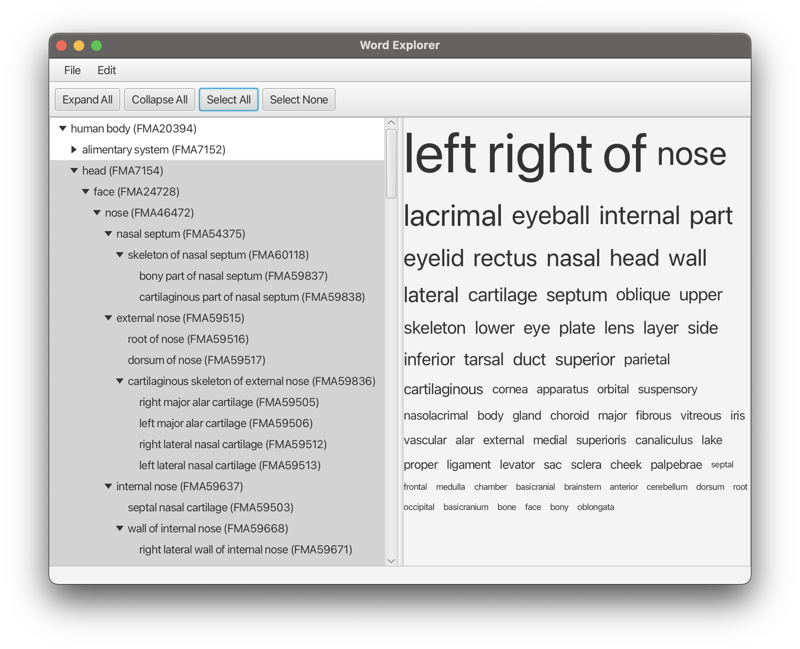

# Advanced Java Repository of Niklas M. Gerbes
Group: Luis Reimer, Niklas Gerbes

## NOTE:
The whole project structure was rebuild to better manage the final project itself!

- ALL ASSIGNMENTS ARE NOW FOUND IN THE MODULE: `assignmnets`
- THE PROJECT IS FOUND IN THE MODULE: `project`

Additional information can be found in the READMES of these modules!

## Project:

## Assignment implementations:

### assignment01: ShowRelationsTree
Simple CLI tool to process the [partof_inclusion_relation_list.txt](assignments/src/main/resources/asgmt01_res/partof_inclusion_relation_list.txt) file.
Goal was to print the full path of each relation to the console.

### assignment02: AnatomyDataExplorer

This tool lists all body parts in a treeView and shows the corresponding file names on the right side
of a splitPane.

### assignemnt03: WordExplorer

Here we build a wordCloud based on the selected parts.

### assignment04: TreeDrawer

With this UI we visualized the relations in a tree.

### assignment05: ObjectViewer

Assignment05 was the first steps towards 3D modeling and presentation of .obj files in a three-dimensional space.

### assignment06: ObjectViewer6

The 3D model viewer was expanded to allow mouse controls, and the option to load multiple .obj files into one ThreeDPane.
